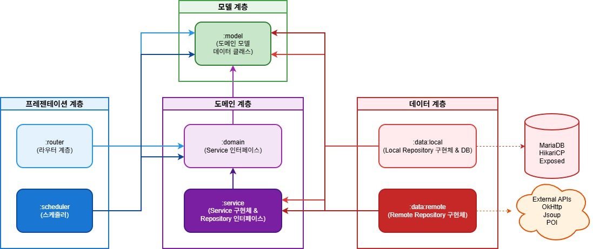

# 온기 (On:Gi) - 백엔드 서버

**'온기' 서비스의 백엔드 서버입니다. 착한가게 인증 정보를 기반으로 사용자에게 주변 가게를 소개합니다.**
<br/>
착한가게 업소 데이터는 공공데이터 API를 통해 일일 스케줄링으로 동기화되며, MariaDB에 저장되어 클라이언트에 제공됩니다.

<br/>

## 📌 기술 스택

- **언어**: Kotlin
- **프레임워크**: Ktor 3.3.3
- **데이터베이스**: MariaDB
- **ORM**: Exposed
- **연결 풀**: HikariCP
- **직렬화**: kotlinx.serialization (JSON)
- **스케줄링**: ktor-server-task-scheduling
- **HTTP 클라이언트**: Ktor Client (OkHttp)
- **웹 스크래핑**: Jsoup
- **엑셀 처리**: Apache POI
- **컨테이너화**: Docker, Docker Compose

---
<br/>

## 🧱 아키텍처 및 모듈 구성

- **아키텍처 패턴**: Clean Architecture
- **설계 원칙**: 계층 분리 (Domain, Service, Data, Router)
- **모듈 구성**:
    - `:model` – 공통 도메인 모델 정의
    - `:domain` – 도메인 서비스 인터페이스 (비즈니스 로직 정의)
    - `:service` – 서비스 구현체 및 Repository 인터페이스
    - `:data:local` – 로컬 데이터베이스 (MariaDB + Exposed)
    - `:data:remote` – 원격 데이터 소스 (공공데이터 API, 지오코딩 API 등)
    - `:router` – HTTP 라우팅 및 API 엔드포인트
    - `:schedular` – 스케줄링 작업 (데이터 동기화 등)
    - `:app` – 애플리케이션 진입점 및 설정

### 아키텍처 다이어그램

<br/>

**계층별 설명**:
- **프레젠테이션 계층**: HTTP 요청 처리(`:router`) 및 스케줄링 작업(`:scheduler`)을 담당
- **모델 계층**: 모든 계층에서 공통으로 사용하는 도메인 모델 정의
- **도메인 계층**: 비즈니스 로직을 정의(`:domain`)하고 구현(`:service`)하며, Repository 인터페이스를 통해 데이터 접근을 추상화
- **데이터 계층**: Repository 인터페이스의 구현체를 제공하며, 로컬 DB(`:data:local`)와 외부 API(`:data:remote`)와 통신
- **외부 데이터 소스**: MariaDB(로컬 저장소) 및 외부 API(원격 데이터 소스)
---


## 📁 폴더 구조

### 전체 구조

```
ONGI_Ktor/
├── app/                    # 애플리케이션 진입점
├── model/                  # 공통 도메인 모델
├── domain/                 # 도메인 서비스 인터페이스
├── service/                # 서비스 구현 및 Repository 인터페이스
├── data/
│   ├── local/              # 로컬 데이터베이스 레이어
│   └── remote/             # 원격 데이터 소스 레이어
├── router/                 # HTTP 라우팅 레이어
├── schedular/              # 스케줄링 작업
├── src/main/               # 메인 애플리케이션
│   ├── kotlin/
│   │   └── Application.kt
│   └── resources/
│       ├── application.yaml
│       └── logback.xml
├── compose.yml             # Docker Compose 설정
├── Dockerfile              # Docker 이미지 빌드 설정
└── build.gradle.kts        # 루트 빌드 설정
```

<details>
 <summary>📦 model 모듈 상세 구조</summary>

```
model/
└── src/main/kotlin/
    ├── Banner.kt                    # 배너 모델
    ├── Favorite.kt                  # 즐겨찾기 모델
    ├── Juso.kt                      # 주소 모델
    ├── Menu.kt                      # 메뉴 모델
    ├── Point.kt                     # 좌표 모델
    ├── RemoteMenu.kt                # 원격 메뉴 모델
    ├── RemoteStore.kt               # 원격 가게 모델
    ├── Store.kt                     # 가게 모델
    ├── StoreDetail.kt               # 가게 상세 모델
    ├── StorePage.kt                 # 가게 페이징 모델
    ├── User.kt                      # 사용자 모델
    ├── query/                       # 쿼리 파라미터 모델
    │   ├── StoreQueryCategory.kt
    │   ├── StoreQueryDistance.kt
    │   └── StoreQuerySortType.kt
    └── sync/                        # 동기화 결과 모델
        ├── StoreSyncResult.kt
        └── SyncResult.kt
```

</details>

<details>
 <summary>🎯 domain 모듈 상세 구조</summary>

```
domain/
└── src/main/kotlin/service/
    ├── BannerService.kt             # 배너 서비스 인터페이스
    ├── FavoriteService.kt           # 즐겨찾기 서비스 인터페이스
    ├── StoreService.kt              # 가게 서비스 인터페이스
    ├── SyncStoreService.kt          # 가게 동기화 서비스 인터페이스
    ├── SyncTimeService.kt           # 동기화 시간 서비스 인터페이스
    └── UserService.kt               # 사용자 서비스 인터페이스
```

</details>

<details> 
<summary>⚙️ service 모듈 상세 구조</summary>

```
service/
└── src/main/kotlin/
    ├── repository/                  # Repository 인터페이스
    │   ├── local/                   # 로컬 Repository 인터페이스
    │   │   ├── BannerRepository.kt
    │   │   ├── FavoriteRepository.kt
    │   │   ├── MenuRepository.kt
    │   │   ├── StoreDetailRepository.kt
    │   │   ├── StoreRepository.kt
    │   │   ├── SyncTimeRepository.kt
    │   │   └── UserRepository.kt
    │   └── remote/                  # 원격 Repository 인터페이스
    │       ├── RemoteAPIStoreRepository.kt
    │       ├── RemoteGeocoderRepository.kt
    │       ├── RemoteOfficialStoreRepository.kt
    │       ├── RemoteRoadAddressRepository.kt
    │       └── RemoteStoreBannerRepository.kt
    ├── service/                     # 서비스 구현체
    │   ├── di/
    │   │   └── Framework.kt         # 의존성 주입 설정
    │   ├── impl/                    # 서비스 구현
    │   │   ├── BannerServiceImpl.kt
    │   │   ├── FavoriteServiceImpl.kt
    │   │   ├── StoreServiceImpl.kt
    │   │   ├── SyncStoreServiceImpl.kt
    │   │   ├── SyncTimeServiceImpl.kt
    │   │   └── UserServiceImpl.kt
    │   ├── mapper/                  # 데이터 매퍼
    │   │   └── StoreMapper.kt
    │   └── util/                    # 유틸리티
    │       └── TransactionUtil.kt
```

</details>

<details> 
<summary>💾 data/local 모듈 상세 구조</summary>

```
data/local/
└── src/main/kotlin/
    ├── local_config/                # 데이터베이스 설정
    │   └── Databases.kt
    ├── local_dao/                   # 데이터 액세스 객체 (Entity)
    │   ├── BannerEntity.kt
    │   ├── FavoriteEntity.kt
    │   ├── MenuEntity.kt
    │   ├── StoreDetailEntity.kt
    │   ├── StoreEntity.kt
    │   ├── SyncTimeEntity.kt
    │   └── UserEntity.kt
    ├── local_di/                    # 의존성 주입 설정
    │   └── Framework.kt
    ├── local_mapper/                # Entity ↔ Model 매퍼
    │   ├── BannerMapper.kt
    │   ├── FavoriteMapper.kt
    │   ├── StoreMapper.kt
    │   ├── SyncTimeMapper.kt
    │   └── UserMapper.kt
    ├── local_repository/            # Repository 구현체
    │   ├── impl/
    │   │   ├── BannerRepositoryImpl.kt
    │   │   ├── FavoriteRepositoryImpl.kt
    │   │   ├── MenuRepositoryImpl.kt
    │   │   ├── StoreDetailRepositoryImpl.kt
    │   │   ├── StoreRepositoryImpl.kt
    │   │   ├── SyncTimeRepositoryImpl.kt
    │   │   └── UserRepositoryImpl.kt
    │   └── util/                    # Repository 유틸리티
    │       ├── DoubleExpression.kt
    │       ├── RepositoryUtil.kt
    │       └── SortUtil.kt
    ├── local_table/                 # Exposed 테이블 정의
    │   ├── BannerTable.kt
    │   ├── FavoriteTable.kt
    │   ├── MenuTable.kt
    │   ├── StoreDetailTable.kt
    │   ├── StoreTable.kt
    │   ├── SyncTimeTable.kt
    │   └── UserTable.kt
    └── local_util/                  # 데이터베이스 유틸리티
        ├── DatabaseUtil.kt
        └── KotlinTimeInstantColumnType.kt
```

</details>

<details> 
<summary>🌐 data/remote 모듈 상세 구조</summary>

```
data/remote/
└── src/main/kotlin/
    ├── remote_data/                 # 원격 API DTO
    │   ├── geocode/                 # 지오코딩 API 응답
    │   │   ├── error/
    │   │   ├── request/
    │   │   └── response/
    │   ├── road/                    # 도로명 주소 API 응답
    │   │   ├── RemoteCommonResponse.kt
    │   │   ├── RemoteJuso.kt
    │   │   ├── RemoteJusoResponse.kt
    │   │   └── RemoteJusoResult.kt
    │   ├── store/                   # 가게 데이터
    │   │   ├── api/                 # 공공데이터 API 응답
    │   │   │   ├── CloudPageDTO.kt
    │   │   │   ├── CloudStoreDTO.kt
    │   │   │   └── GoodPriceApiProperties.kt
    │   │   └── excel/               # 엑셀 데이터
    │   │       └── OfficialStoreDTO.kt
    │   └── RemoteBannerDTO.kt
    ├── remote_di/                   # 의존성 주입 설정
    │   └── Framework.kt
    ├── remote_impl/                 # Repository 구현체
    │   ├── RemoteAPIStoreRepositoryImpl.kt
    │   ├── RemoteGeocoderRepositoryImpl.kt
    │   ├── RemoteOfficialStoreRepositoryImpl.kt
    │   ├── RemoteRoadAddressRepositoryImpl.kt
    │   └── RemoteStoreBannerRepositoryImpl.kt
    ├── remote_mapper/               # DTO ↔ Model 매퍼
    │   ├── BannerMapper.kt
    │   ├── JusoMapper.kt
    │   └── StoreMapper.kt
    └── remote_util/                 # 원격 데이터 처리 유틸리티
        ├── address/
        │   └── AddressUtil.kt
        ├── extract/                 # 데이터 추출
        │   ├── BannerExtractor.kt
        │   └── ExcelStoreExtractor.kt
        └── network/                 # 네트워크 설정
            ├── EnvironmentConfig.kt
            ├── NetworkUtil.kt
            └── RemoteHttpClientConfig.kt
```

</details>

<details> 
<summary>🛣️ router 모듈 상세 구조</summary>

```
router/
└── src/main/kotlin/
    ├── route/                       # API 라우트 정의
    │   ├── BannerRoute.kt
    │   ├── StoreRoute.kt
    │   ├── SyncTimeRoute.kt
    │   └── UserRoute.kt
    ├── route_config/                # 라우팅 설정
    │   ├── ExceptionHandlers.kt     # 예외 처리
    │   ├── JsonHandler.kt           # JSON 직렬화 설정
    │   ├── Monitoring.kt            # 모니터링 설정
    │   ├── Routing.kt               # 라우팅 등록
    │   └── StaticResource.kt        # 정적 리소스 설정
    ├── route_dto/                   # API 요청/응답 DTO
    │   ├── BannerDTO.kt
    │   ├── ErrorDTO.kt
    │   ├── LikeInfoResponseDTO.kt
    │   ├── MenuDTO.kt
    │   ├── StoreDetailDTO.kt
    │   ├── StoreDTO.kt
    │   ├── StorePageDTO.kt
    │   ├── UserRequestDTO.kt
    │   └── UserResponseDTO.kt
    ├── route_mapper/                # DTO ↔ Model 매퍼
    │   ├── BannerMapper.kt
    │   ├── StoreMapper.kt
    │   └── UserMapper.kt
    └── route_util/                  # 라우팅 유틸리티
        └── RoutingCallHelper.kt
```

</details>

<details> 
<summary>⏰ schedular 모듈 상세 구조</summary>

```
schedular/
└── src/main/kotlin/scheduler/
    ├── StoreSyncScheduler.kt        # 가게 데이터 동기화 스케줄러
    └── TaskSchedulingConfig.kt      # 스케줄링 설정
```

</details>

---
<br/>

## 🚀 실행 방법

### 사전 요구사항

- JDK 21 이상
- Docker & Docker Compose
- MariaDB (또는 Docker로 실행)

<br/>

## 📡 주요 API 엔드포인트

- **가게 관련**
  - `GET /api/stores` - 가게 목록 조회 (페이징, 필터링, 정렬 지원)
  - `GET /api/stores/{id}` - 가게 상세 정보 조회
  - `POST /api/stores/{id}/favorite` - 가게 즐겨찾기 추가
  - `DELETE /api/stores/{id}/favorite` - 가게 즐겨찾기 제거

- **배너 관련**
  - `GET /api/banners` - 배너 목록 조회

- **사용자 관련**
  - `POST /api/users` - 사용자 등록
  - `GET /api/users/{id}` - 사용자 정보 조회
  - `GET /api/users/{id}/favorites` - 사용자 즐겨찾기 목록

- **동기화 관련**
  - `GET /api/sync/time` - 마지막 동기화 시간 조회

자세한 API 문서는 Swagger UI (`/swagger-ui`)에서 확인할 수 있습니다.

---
<br/>

## 🔄 데이터 동기화

착한가게 업소 데이터는 스케줄러를 통해 일일 자동 동기화됩니다:

- **공공데이터 API**: 착한가게 인증 업소 정보 수집
- **지오코딩 API**: 주소를 좌표로 변환
- **도로명 주소 API**: 주소 정규화 및 검증
- **배너 추출**: 웹 스크래핑을 통한 배너 이미지 수집

동기화 작업은 `ktor-server-task-scheduling`을 사용하여 관리됩니다.

---
<br/>

## 🏗️ 아키텍처 특징

- **Clean Architecture**: 계층 간 의존성 방향 준수 (Domain ← Service ← Router)
- **의존성 역전**: Repository 인터페이스는 Service 레이어에 정의, 구현은 Data 레이어에서 제공
- **모듈 분리**: 기능별 모듈 분리로 유지보수성 향상
- **비동기 처리**: Kotlin Coroutines를 활용한 비동기 처리
- **트랜잭션 관리**: Exposed를 통한 데이터베이스 트랜잭션 관리

---
<br/>

## 📝 참고 사항

- 데이터베이스 스키마는 Exposed를 통해 코드로 관리됩니다.
- 환경 변수는 `application.yaml` 또는 Docker Compose의 환경 변수로 설정할 수 있습니다.
- 로깅은 Logback을 사용하며, `logback.xml`에서 설정을 변경할 수 있습니다.

---
